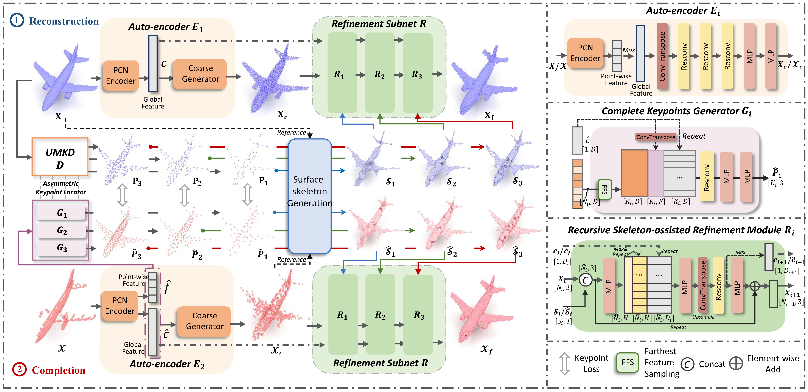

# *LAKe-Net:* Topology-Aware Point Cloud Completion by Localizing Aligned Keypoints

This repository contains the PyTorch implementation of the paper:

**LAKe-Net: Topology-Aware Point Cloud Completion by Localizing Aligned Keypoints, CVPR 2022**

<!-- <br> -->
[Junshu Tang](https://junshutang.github.io/),  [Zhijun Gong](https://dmcv.sjtu.edu.cn/), [Ran Yi](https://yiranran.github.io/), [Yuan Xie](https://scholar.google.com/citations?user=RN1QMPgAAAAJ&hl=en), and [Lizhuang Ma](https://dmcv.sjtu.edu.cn/).
<!-- <br> -->

[[arxiv](https://arxiv.org/pdf/2203.16771)|[paper](https://openaccess.thecvf.com/content/CVPR2022/html/Tang_LAKe-Net_Topology-Aware_Point_Cloud_Completion_by_Localizing_Aligned_Keypoints_CVPR_2022_paper.html)]


## Abstract

> Point cloud completion aims at completing geometric and topological shapes from a partial observation. However, some topology of the original shape is missing, existing methods directly predict the location of complete points, without predicting structured and topological information of the complete shape, which leads to inferior performance. To better tackle the missing topology part, we propose LAKe-Net, a novel topology-aware point cloud completion model by localizing aligned keypoints, with a novel **Keypoints-Skeleton-Shape** prediction manner. Specifically, our method completes missing topology using three steps: **1) Aligned Keypoint Localization.** An asymmetric keypoint locator, including an unsupervised multi-scale keypoint detector and a complete keypoint generator, is proposed for localizing aligned keypoints from complete and partial point clouds. We theoretically prove that the detector can capture aligned keypoints for objects within a sub-category. **2) Surface-skeleton Generation.** A new type of skeleton, named Surface-skeleton, is generated from keypoints based on geometric priors to fully represent the topological information captured from keypoints and better recover the local details. **3) Shape Refinement.** We design a refinement subnet where multi-scale surface-skeletons are fed into each recursive skeleton-assisted refinement module to assist the completion process. Experimental results show that our method achieves the state-of-the-art performance on point cloud completion.


## Architecture Overview
<p align="center"> 

</p>


## Citation
If you find our code useful, please cite our paper:
```bibtex
@inproceedings{tang2022lake,
  title={LAKe-Net: Topology-Aware Point Cloud Completion by Localizing Aligned Keypoints},
  author={Tang, Junshu and Gong, Zhijun and Yi, Ran and Xie, Yuan and Ma, Lizhuang},
  booktitle={Proceedings of the IEEE/CVF Conference on Computer Vision and Pattern Recognition},
  pages={1726--1735},
  year={2022}
}
```


## License
Our code is released under MIT License.


## Acknowledgement
We thanks the [VRCNet](https://github.com/paul007pl/VRCNet) for sharing their code.


